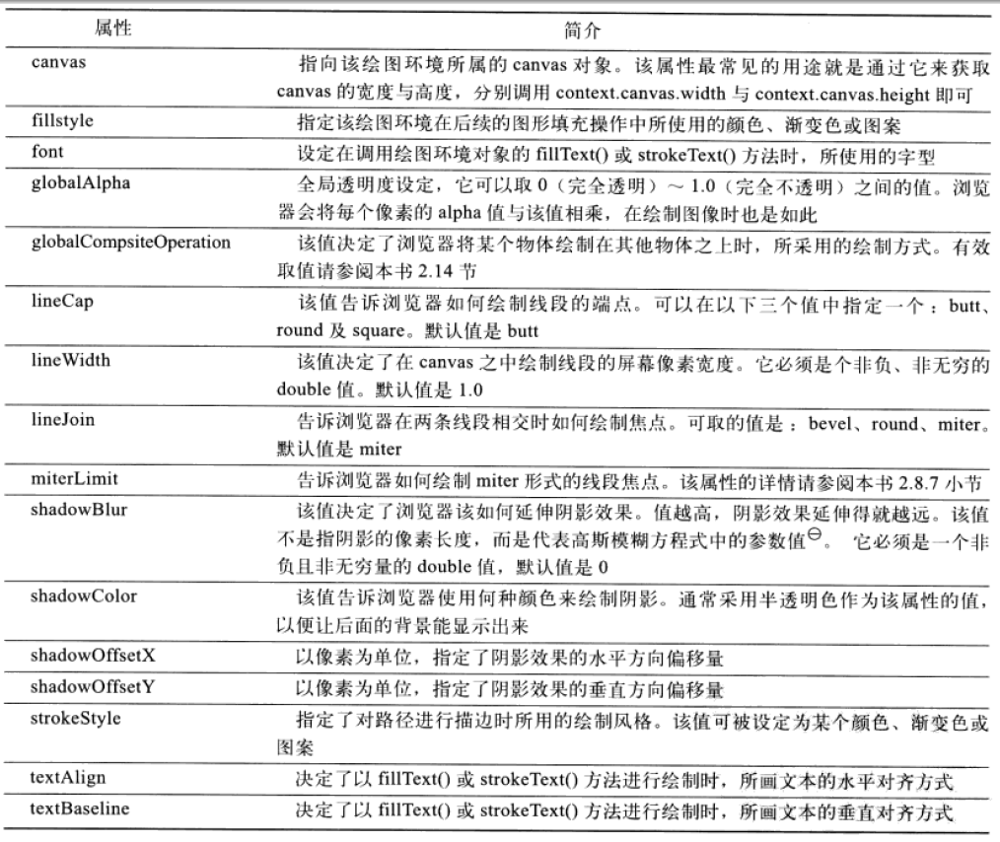
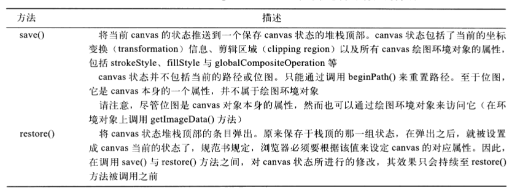

#### 1.canvas元素的大小(css设置)与绘图表面的大小(通过canvas的width和height属性设置)。

#### 2.canvas的属性：width和height；

#### 3.canvas的方法：getContext('2d')、toDataURL('image/png', .5)、toBlob();

#### 4.2d对象所含属性

#### 5.2d对象的状态操作函数：save()、restore();

##### 6.getImageData()和putImageData();
