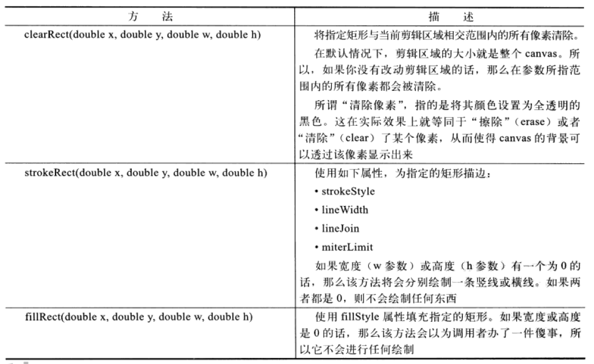
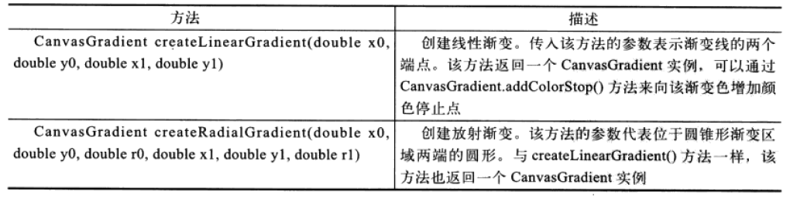
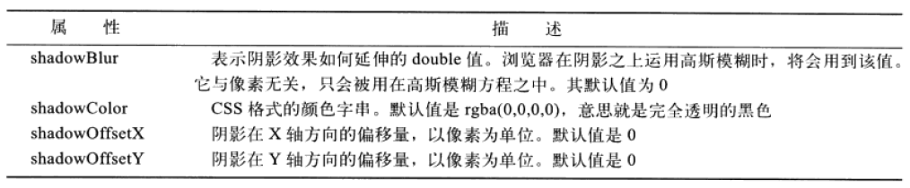
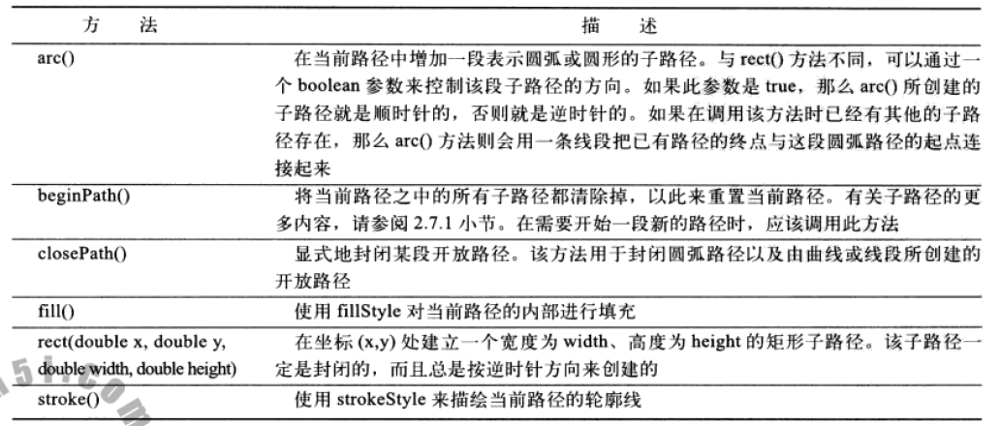

## 1.绘制矩形
```js
clearRect(double x, double y, double w, double h);
fillRect(double x, double y, double w, double h);
strokeRect(double x, double y, double w, double h);
```


## 2.透明填充
> color填充: ctx.fillStyle = rgba(0, 0, 0, .5);

> 设置全局透明: ctx.globalAlpha = .5;

## 3.渐变色



### 3.1 横向线性渐变
```js
var c = document.querySelector("#canvas");
var ctx = c.getContext("2d");

var gradient = ctx.createLinearGradient(0,0,c.width, 0);
gradient.addColorStop(0, "#e6e600");
gradient.addColorStop(0.25, "#d1c50b");
gradient.addColorStop(0.5, "#d49500");
gradient.addColorStop(0.75, "#dd8810");
gradient.addColorStop(1, "#ff0000");

ctx.fillStyle = gradient;
ctx.fillRect(0, 0 , c.width, c.height);
```

### 3.2 斜向线性渐变
```js
var c = document.querySelector("#canvas");
var ctx = c.getContext("2d");

var gradient = ctx.createLinearGradient(0, 0, c.width, c.height);
gradient.addColorStop(0, "#e6e600");
gradient.addColorStop(0.25, "#d1c50b");
gradient.addColorStop(0.5, "#d49500");
gradient.addColorStop(0.75, "#dd8810");
gradient.addColorStop(1, "#ff0000");

ctx.fillStyle = gradient;
ctx.fillRect(0, 0 , c.width, c.height);
```

### 3.3 放射渐变
```js
var c = document.querySelector("#canvas");
var ctx = c.getContext("2d");

var gradient = ctx.createRadialGradient(
    c.width/2, 0, 10,
    c.width/2, c.height, 100
);
gradient.addColorStop(0, "#e6e600");
gradient.addColorStop(0.25, "#d1c50b");
gradient.addColorStop(0.5, "#d49500");
gradient.addColorStop(0.75, "#dd8810");
gradient.addColorStop(1, "#ff0000");

ctx.fillStyle = gradient;
ctx.fillRect(0, 0 , c.width, c.height);
```

## 4.图案填充
```js
var c = document.querySelector("#canvas");
var ctx = c.getContext("2d");
var img = new Image();
img.src="img/icon.png";
img.onload = function (e) {
    //repeat, repeat-x, repeat-y, no-repeat
    var pattern = ctx.createPattern(img, "repeat");
    ctx.fillStyle = pattern;
    ctx.fillRect(0,0,c.width,c.height);
}
```

## 5.阴影

```js
var c = document.querySelector("#canvas");
var ctx = c.getContext("2d");

ctx.shadowColor = "rgba(255, 0, 0, .5)";
ctx.shadowOffsetX = 1;
ctx.shadowOffsetY = 1;
ctx.shadowBlur = 8;

ctx.font = "bold 30pt 微软雅黑";
ctx.fillText("Hello Canvas", c.width/2, c.height/2);
```

## 6.绘制路径

```js
var c = document.querySelector("#canvas");
var ctx = c.getContext("2d");

ctx.strokeStyle = "#f00";
ctx.lineWidth = 2;
ctx.lineJoin = "round";
ctx.fillStyle = "rgba(255,0,0,.5)";

ctx.beginPath();
//x,y,radius,startAngle,endAngle,anticlockwise
ctx.arc(100, 100, 50, 0, Math.PI/2, true);
ctx.stroke();

ctx.beginPath();
ctx.arc(100, 100, 50, 0, Math.PI/2, false);
ctx.lineTo(100, 100);
ctx.closePath();
ctx.stroke();
ctx.fill();

ctx.beginPath();
//x, y, w, h
ctx.rect(200, 100, 200, 100);
ctx.stroke();
ctx.fill();
```