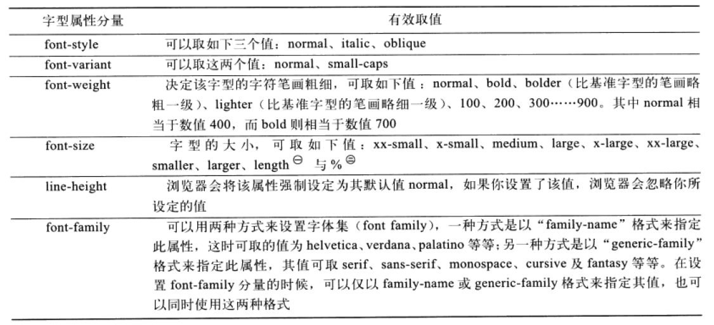

## 三个与文本有关的方法
!(measureText)[img/measuretext.png]
```js
strokeText(text, x, y)
fillText(text, x, y)
measureText(text)
```

## 三个与文本有关的属性

```js
//字体属性顺序：font-style,font-variant,font-weight,font-size,font-family
ctx.font = "normal 15px Times New Roman";

//可能值：start,center,end,left,right
ctx.textAlign = "";

//可能值：top, middle, bottom
ctx.textBaseline = "";
```

## 绘制圆形文字
```js
    function drawCircularText(centerx, centery, r, startAngle, endAngle, text) {
        startAngle = Math.PI/180 * startAngle;
        endAngle = Math.PI/180 * endAngle;
        var radius = r,
            angleDecrement = (startAngle - endAngle)/(text.length-1),
            angle = parseFloat(startAngle),
            index = 0,
            character;

        ctx.save();
        ctx.fillStyle = "red";
        ctx.font = 'bold 18px 微软雅黑';
        ctx.textBaseline = "top";
        ctx.textAlign = "center";
        ctx.lineWidth = 1;
        ctx.strokeStyle = "black";

        while (index < text.length) {
            character = text.charAt(index);

            ctx.save();
            ctx.beginPath();

            ctx.translate(
                centerx + Math.cos(angle) * radius,
                centery - Math.sin(angle) * radius);

            ctx.rotate(Math.PI/2 - angle);

            ctx.fillText(character, 0, 0);
//            ctx.strokeText(character, 0, 0);

            angle -= angleDecrement;
            index++;

            ctx.restore();
        }
        ctx.restore();
    }
```