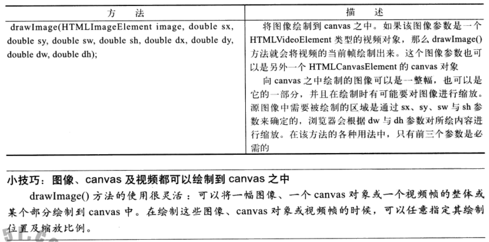

## 四个绘制与操作图像的方法


```js
//drawImage
ctx.drawImage(image,dx,dy);
ctx.drawImage(image,dx,dy,dw,dh);
ctx.drawImage(image,sx,sy,sw,sh,dx,dy,dw,dh);

ctx.createImageData(imagedata_or_sw,sh);
ctx.getImageData(sx,sy,sw,sh);
ctx.putImageData(image_data,dx,dy,dirtyX,dirtyY,dirtyWidth,dirtyHeight);
```
## 变灰效果
```js
        var imagedata = ctx.getImageData(0, 0, c.width, c.height),
            data = imagedata.data;

        //变灰
        for(var i=0; i < data.length - 4; i+=4) {
            var average = (data[i] + data[i+1] + data[i+2]) / 3;
            data[i]   = average;
            data[i+1] = average;
            data[i+2] = average;
        }

        ctx.putImageData(imagedata, 0, 0);
```
## 阴像效果
```js
        var imagedata = ctx.getImageData(0, 0, c.width, c.height),
            data = imagedata.data;

        //阴像
        for(var i=0; i <= data.length - 4; i+=4) {
            data[i]   = 255 - data[i]
            data[i+1] = 255 - data[i+1];
            data[i+2] = 255 - data[i+2];
        }
        ctx.putImageData(imagedata, 0, 0);
```
## 浮雕效果
```js
   var imagedata, data, length, width;

   imagedata = context.getImageData(0, 0,
                                    canvas.width, canvas.height);
   data = imagedata.data;
   width = imagedata.width;
   length = data.length;

   for (i=0; i < length; i++) { // loop through every pixel

      // if we won't overrun the bounds of the array
      if (i <= length-width*4) {

         // if it's not an alpha
         if ((i+1) % 4 !== 0) {

            // if it's the last pixel in the row, there is
            // no pixel to the right, so copy previous pixel's
            // values.

            if ((i+4) % (width*4) == 0) {
               data[i] = data[i-4];
               data[i+1] = data[i-3];
               data[i+2] = data[i-2];
               data[i+3] = data[i-1];
               i+=4;
            }
            else { // not the last pixel in the row
               data[i] = 255/2         // Average value
                         + 2*data[i]   // current pixel
                         - data[i+4]   // next pixel
                         - data[i+width*4]; // pixel underneath
            }
         }
      }
      else { // last row, no pixels underneath,
             // so copy pixel above
         if ((i+1) % 4 !== 0) {
            data[i] = data[i-width*4];
         }
      }
   }
   context.putImageData(imagedata, 0, 0);
```
