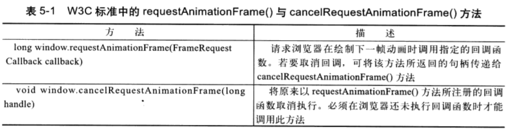

# 动画
 ```js
 
function animate() {
  //---
}

//setInterval实现动画
setInterval(animate, 1000/60);

//setTimeout实现动画
function animateT() {
    animate();
   setTimeout(animateT, 1000/60);
}
```

;

```js
window.requestAnimFrame = (function(){
  return  window.requestAnimationFrame       ||
          window.webkitRequestAnimationFrame ||
          window.mozRequestAnimationFrame    ||
          function( callback ){
            window.setTimeout(callback, 1000 / 60);
          };
})();
```